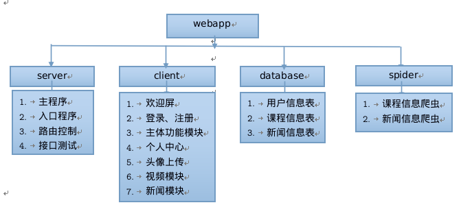

# 前言
放了一年的webapp项目[framework7_app](https://github.com/zhenxianluo/framework7_app)终于决定加以完善。用到了一些新技术就取名为nsf7app吧。

# 主要技术栈
服务器：`Nodejs + Express`  
数据库：`PostgreSQL`  
前端框架：`Framework7`  
数据交互：`jQuery + Ajax`  
数据抓取：`Python + Scrapy`  
模板引擎：`ejs`  
接口功能测试：`chai + mocha`  
版本控制：`git`  
编码工具：`vim`、`sublime`  
辅助工具：`chrome-tools`、`postman`、`ipdb`、`scrapy-shell`、`BeautifulSoup4`  
项目迁移与部署：`docker`

# 项目docker化

项目现已docker话，以ubuntu:14.04容器为基础，需要本地安装好docker，然后执行
1. 进入项目的根目录。
2. 执行Dockerfile文件：`sudo docker build -t rnet/webapp ./`
3. 运行并指定端口映射关系：`sudo docker run --restart=always -p 3000:3000 -p 5432:5432 rnet/webapp`
4. 本机ip加端口号3000打开查看网站，程序图片见public/imgshow目录

# 功能结构图

# 交流与联系
博客：[HOWDUUDU（好读优读）](http://howduudu.xyz)  
邮箱：<zxl_d@foxmail.com> and <chinaitlearner@gmail.com>

# 有空完善和作全文教程

